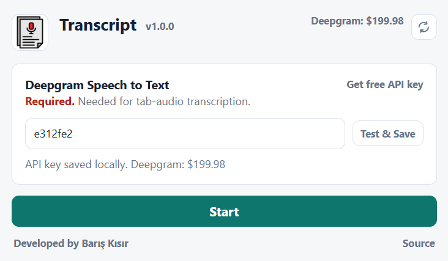

# ChromeTranscript

ChromeTranscript is a local Chrome extension that captures audio and transcribes speech with Deepgram. It stores multiple transcripts locally, lets you switch between them, and keeps the interface focused on live transcription.

Desktop App -> https://github.com/bariskisir/Transcript

---

## Features

- Audio transcription with Deepgram
- Language selection for Deepgram speech-to-text

## Demo

## Playground
https://www.youtube.com/watch?v=5BNPeFHU7QQ

## Install

1. Download the latest release: https://github.com/bariskisir/ChromeTranscript/releases/latest/download/dist.zip
2. Unzip the archive.
3. Open `chrome://extensions`.
4. Enable **Developer mode**.
5. Click **Load unpacked**.
6. Select the extracted `dist` folder.

## Development

0. Clone the repository `git clone https://github.com/bariskisir/ChromeTranscript`
1. Install dependencies with `npm install`.
2. Run the extension with `npm run dev`.
3. Open `chrome://extensions`.
4. Enable **Developer mode**.
5. Click **Load unpacked**.
6. Select the `dist` folder.

## License
MIT
